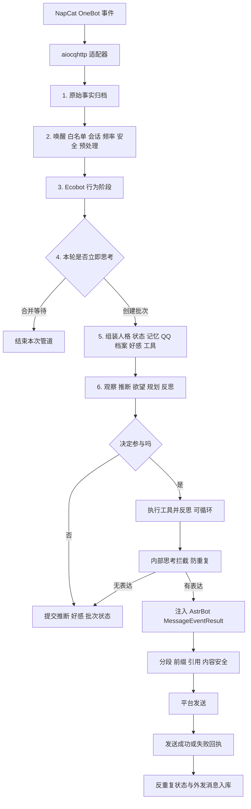
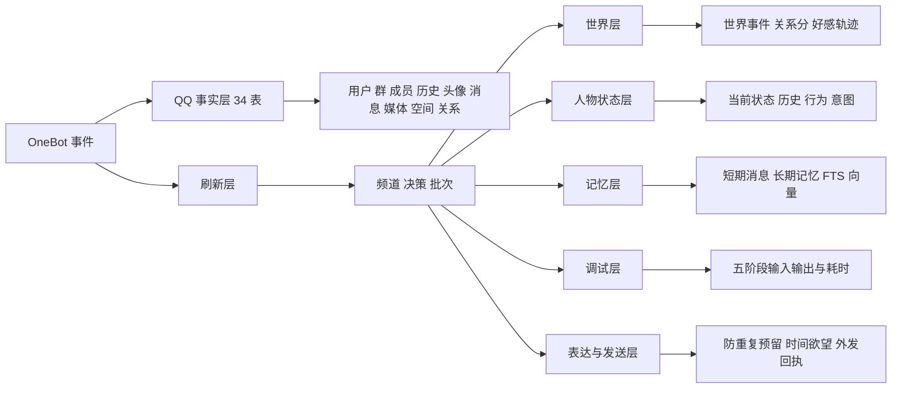

# Ecobot 信息获取、回复与入库架构

> 分析范围：NapCat/OneBot 消息进入 AstrBot 后，到 Ecobot 回复发送完成并写入 `world.db` 为止。
> 不包含 WebUI、更新器、插件市场和桌面壳层。

## 结论先行

当前实现不是一条简单的“收到消息 -> 调用 AI -> 回复”链路，而是由 AstrBot 的 11 段消息管道、Ecobot 的事实归档支线、刷新调度器、五阶段认知、工具反馈循环、发送回执和 52 张业务表共同组成。一次普通消息最多会经过五次独立模型调用；同一个 `world.db` 由多个 Store 分别持有 SQLite 连接；部分数据在发送成功之前就已提交。因此，功能虽然完整，但观察入口分散，确实容易形成黑箱。

从业务角度压缩后，系统实际只有七个核心环节：接收、归档、过滤、组装上下文、思考、发送、提交回执。其余类大多是这七个环节的子实现。

## 一、AstrBot 外层管道

管道顺序在 `backend/app/astrbot/core/pipeline/stage_order.py` 中固定。事件依次经过 `EcobotArchiveStage`、唤醒判断、白名单、会话开关、限流、内容安全、媒体预处理、`EcobotBehaviorStage`、AstrBot 原处理器、结果装饰和最终发送。调度器逐段执行，任何阶段调用 `event.stop_event()` 都会终止后续传播。

这里最关键的设计是：`EcobotArchiveStage` 位于白名单之前。这意味着即使某个 QQ 或群被白名单拒绝，原始事件依旧可能先进入 QQ 事实档案。白名单只控制“是否继续思考和回复”，并不控制“是否收集”。

唤醒阶段还会给未直接唤醒机器人的群消息标记 `_ecobot_passive_observation`。因此 Ecobot 可以观察普通群聊，而原 AstrBot 默认链路不会被唤醒。私聊、明确 @、回复机器人或唤醒词则会被视为强触发信号。

## 二、第一条支线：QQ 事实归档

`EcobotArchiveStage.process()` 首先调用 `QQArchive.record_event()`。该函数只接受 `aiocqhttp`，也就是 OneBot v11/NapCat 事件。它从事件中提取机器人 QQ、发送者 QQ、昵称、群名片、群号、群角色、消息 ID、原始消息段和完整原始 JSON。

一条消息会产生或更新多类事实：QQ 用户与机器人账号、群和群成员关系、昵称与群名片变化、管理员或群主角色变化、原始事件、消息正文、消息段、@ 提及、回复关系、媒体待下载记录，以及人物之间的互动证据。相邻三分钟内不同成员的连续发言也会被记为低权重关系证据。

归档完成后，`QQSyncCoordinator.schedule()` 在后台补全远端数据。它可能调用 NapCat 获取好友列表、群列表、群成员快照和最近群历史，也会抓取用户头像、群头像和待下载媒体。QQ 空间只有在配置了 `QZoneSource` 时才会同步；当前代码本身不凭空提供空间接口。

归档支线不会等待这些远端同步全部完成，因此主回复链不会被头像或群成员拉取阻塞。代价是本轮模型看到的资料可能仍是上一轮快照，新的同步结果通常在后续消息中生效。

## 三、第二条主线：行为触发与批次调度

`EcobotBehaviorStage` 位于 AstrBot 预处理之后。显式插件命令、命令组或正则处理器会绕过 Ecobot，交还原 AstrBot 插件链。QQ 输入状态通知不会触发思考，并会被直接终止。

正常事件会被转换成不可变的 `Stimulus`。它包含事件 ID、统一频道 ID、发送者 QQ、文本轮廓、时间戳，以及平台、群号、私聊、唤醒、管理员、@、回复、图片和语音等元数据。原始大 JSON 不直接进入 `Stimulus`，而是留在事实档案中。

`RefreshScheduler` 决定是否立刻处理。私聊和明确唤醒始终立即处理；频道第一条消息立即处理；普通被动群消息按默认 15 秒窗口合并；同一个事件 ID 不会重复创建批次；空闲心跳只在 `next_idle_at` 到期时处理。每个频道有独立 `asyncio.Lock`，所以同一频道串行，不同频道可以并行。

调度决策本身会立即写入 `ecobot_refresh_decisions`。真正处理的批次写入 `ecobot_behavior_batches`，状态从 `waiting` 变为 `running`，最终变为 `completed` 或 `failed`。频道级计数器、最近处理时间和下次空闲时间写入 `ecobot_refresh_channels`。

## 四、进入 AI 前到底给了什么信息

行为桥接器在每个批次开始前临时组装上下文。它不会只把当前消息扔给模型，而是组合六类信息。

第一类是当前刺激，即本轮消息及直接元数据。第二类是 QQ 社交档案，由 `QQArchive.model_context()` 组装，包括当前昵称、头像、历史昵称、历史头像、好友备注、群资料、群名历史、群头像历史、群名片历史、群角色历史、近期消息、关联人物和关系摘要，并带时间戳。第三类是世界模型，包含该频道最近事件、每个用户的关系分、当前好感画像。第四类是 Ecobot 自身人物状态，包括活动、行为、场景、位置、关注点、同伴、情绪、精力、饥饿、疲劳、社交欲望、目标和预计持续时间。第五类是记忆检索结果。第六类是 AstrBot 当前会话选择的人格和可用工具目录。

记忆分两层。L1 直接读取当前群或当前私聊的近期原始消息；L2 从 `ecobot_memories` 检索长期记忆，并可按全文检索、重要度和向量相似度排序。关系总结与 QQ 空间文本会被提升到 L2，但原始 QQ 消息不会逐条复制成长期记忆。

提示词会主动丢弃 `raw_event`、二进制缓冲区等大字段，并限制每类上下文长度，所以数据库中“已收集”不等于模型“完整看见”。模型看到的是裁剪后的摘要视图。

## 五、五阶段认知的真实调用

`ModelBehaviorThinker` 将一次思考拆成五个可独立开关、可独立选择模型的阶段。每个开启的阶段都是一次单独的 `provider.text_chat()`，因此完整路径通常消耗五次模型请求，而不是一次。

观察阶段只输出当前可确认的事实和摘要。分析推断阶段根据观察和世界快照输出意图、情绪、关系增量、信任增量、熟悉度增量、置信度和关系变化理由。欲望阶段输出 0 到 100 的参与分数、是否参与、沉默原因和理由。规划阶段输出工具动作、最终表达、人物状态更新和是否请求后续心跳。只要执行过工具，反思阶段就根据工具反馈判断是否满意，必要时产生修订计划并再次执行。

所有阶段都使用同一套人格约束，但各自只允许返回规定 JSON。JSON 解析失败时，会根据配置追加纠错提示重试。每一次模型请求的系统提示、输入、输出、模型 ID、耗时和错误都可以写入 `ecobot_ai_phase_traces`。

### 欲望决策

欲望不是单纯采用模型的 `should_engage`。代码会先规范化模型分数，再叠加按频道累计的时间欲望。真实私聊、明确唤醒、@ 或回复是直接信号；处于“深度信赖”且烦躁低于 30 时，会触发参与保障；时间加成达到阈值时也可以把模型的犹豫改为参与。

明确要求安静、垃圾消息、边界冲突和非空闲场景下的无内容，被视为受保护沉默，关系保障和时间欲望都不能覆盖。只有最终分数达到阈值，并且模型、关系保障或时间保障至少一个要求参与，才会进入规划。

## 六、工具、人物状态与世界状态

规划产生的工具动作先经过三重限制：总工具开关、工具白名单、最大风险等级。空闲心跳不允许执行依赖当前消息事件的工具。动作通过 AstrBot 的 `FunctionToolExecutor` 执行，输出被包装成 `ActionFeedback`，并立刻写入世界事件。

同一批次内完全相同的工具名与参数只执行一次。每批默认最多 4 轮动作反思、12 个动作。反思不满意时可给出修订计划；没有修订计划、动作预算耗尽或轮数耗尽都会停止循环。

规划中的 `state_update` 在工具循环之后提交到 `AgentStateStore`。人物状态使用版本号做乐观并发检查，同时记录状态历史和持续行为。到期行为会在下一批开始前自动推进，避免上一轮还在读书、下一轮无缘无故跳到吃饭。

世界模型无论最终回复还是沉默，都会提交本轮 `Inference`。关系分、好感、信任、熟悉度和烦躁因此会在“决定不回复”的消息上照样变化。好感正向变化有递减阻尼，负向变化也有限幅；烦躁会按半衰期自然衰减。

## 七、表达生成、泄漏防护与防重复

规划阶段产生的 `expression` 不是立即发送。`ChatScheduler` 先拒绝空字符串，再尝试把完整表达解析成 JSON。如果文本看起来像包含 `analysis`、`plan`、`desire`、`state_update` 等字段的内部认知对象，就以 `private_cognition_blocked` 拦截，防止整段思考被发出去。

随后 `AntiRepeatGuard.reserve()` 对表达做精确哈希、模糊文本和可选向量相似度检查。通过后只创建一条 `reserved` 记录，并将预留 ID 暂存在内存的 `batch_id -> reservation_id` 映射中。此时仍未真正发送。

值得注意的是，行为桥在得到 `BehaviorResult` 后，会立即把生成的表达写入 `ecobot_memories`，动作反馈也会写入程序性记忆。这里发生在平台发送之前。因此，如果随后 QQ 发送失败，长期记忆中仍可能存在一条“生成过但未成功说出”的表达。这是当前一致性模型中最明显的语义偏差。

## 八、如何接管 AstrBot 并真正发送

若 Ecobot 决定回复，`EcobotBehaviorStage` 会把表达包装为 `MessageEventResult`，标记为 `LLM_RESULT`，清空已激活插件，并调用 `event.should_call_llm(True)`。这个命名容易误解；在当前 AstrBot 中，值为 `True` 的实际含义是禁止默认 LLM 链，因此后面的 `ProcessStage` 不会再次调用 AstrBot 原模型。

随后 `ResultDecorateStage` 继续使用 AstrBot 原能力进行回复前缀、引用、@、内容安全、文字转图片、语音和分段处理。`RespondStage` 才真正调用平台适配器发送。分段回复会把多个文本段逐段发送，并在段间等待。

发送完成后，`RespondStage` 调用 `bridge.mark_expression()`。只有至少尝试过一次发送且所有发送都未报错，整个表达才被标记为成功；成功会重置该频道的时间欲望，失败不会重置。最后 `QQArchive.record_outbound_message()` 将外发正文、批次 ID、目标、成功或失败状态和错误写入 `qq_outbound_messages`。

当前分段回执是“批次级”而不是“分段级”。如果三段中前两段成功、第三段失败，数据库只记整条外发失败，无法准确表达部分成功。

## 九、所有主要分支

### 显式插件命令

事实归档照常发生，但 `EcobotBehaviorStage` 看到命令、命令组或正则处理器后直接返回，后续由 AstrBot 插件链处理。Ecobot 不创建行为批次。

### 白名单拒绝

原始 QQ 事实可能已经归档，随后白名单阶段停止传播。不会进入 Ecobot 思考，也不会回复。

### 普通群消息被合并

事实归档已经完成，刷新调度决策也会入库，但不会建立完整思考结果。若它是被动观察事件，管道被停止，AstrBot 原 LLM 也不会回复。

### 没有模型服务

只要任一认知阶段开启，而当前会话没有可用模型，行为桥返回 `None`。被动事件会被停止；直接唤醒事件则继续向下，可能回退到 AstrBot 原处理链。

### 模型或行为批次异常

批次被标记 `failed`，频道忙状态释放，Ecobot 记录错误并回退到 AstrBot。此时原 AstrBot 可能再次尝试正常回复。

### 欲望决定沉默

推断、关系和好感照常提交，批次标记完成，但不生成回复；随后事件被停止。也就是说，“沉默”不是无处理，而是有认知、有入库、无发送。

### 空闲主动表达

后台每隔数秒扫描到期频道，使用最后一次该频道事件作为发送路由，构造 `trigger=idle` 的虚拟刺激。空闲批次默认不执行工具，可以更新状态，并根据开关主动发送。发送和外发归档由空闲循环自己完成，不经过正常 `RespondStage`。

## 十、数据库职责图

当前 `world.db` 中共有 52 张非 FTS 内部业务表，其中 34 张属于 QQ 事实档案，18 张属于 Ecobot 行为系统。

主要写入时机可以归纳为：事件刚进入时写 QQ 原始事实；刷新决策时写调度表；每次模型调用结束时写阶段追踪；刺激、动作反馈和推断发生时写世界事件；规划后写人物状态；行为结果生成后写长期记忆；真正发送后写表达回执和外发消息。

## 十一、为什么它显得臃肿和黑箱

第一，主流程分布在 AstrBot 管道、Ecobot 桥接器、心跳内核、模型思考器、发送阶段和六个以上 Store 中，没有一个对象拥有完整生命周期视图。调试必须跨文件追踪。

第二，同一个 SQLite 文件被 `EcobotAdminStore`、`WorldModel`、`AgentStateStore`、`MemoryStore`、`AntiRepeatGuard`、`RefreshScheduler` 和两个 `QQArchive` 实例分别打开。WAL 能降低冲突，但事务边界被切碎，无法把“产生表达、发送成功、记忆提交”放进同一事务。

第三，`AstrBotBehaviorBridge.process_stimulus()` 每个批次都会重新创建 `ModelBehaviorThinker` 和 `HeartbeatKernel`。这些对象本身不重，但依赖和配置装配散落在运行路径中，造成理解成本。

第四，五阶段默认等于五次模型请求。观察、推断、欲望之间存在明显可合并空间；反思只在执行工具后真正有价值，但当前抽象仍让整个系统看起来始终拥有五段完整链路。

第五，存在两个发送出口：被动/直接消息走 AstrBot `RespondStage`，空闲主动表达由 `_idle_loop()` 直接调用 `context.send_message()`。两条路径分别实现发送回执，长期维护时容易行为漂移。

第六，数据库同时承担事实仓库、工作队列、状态机、调试日志、向量记忆、全文检索和发送账本。数据很完整，但领域边界只体现在表名前缀，没有统一 Repository 或 Unit of Work，因此“写了什么”只能从各 Store 的副作用反推。

## 十二、建议的简化边界

在不牺牲现有能力的前提下，最合适的目标不是删除数据，而是把运行链压缩成一个可观察的 `MessageOrchestrator`：`collect -> decide -> compose -> deliver -> commit`。QQ 事实收集仍可独立异步运行，但所有认知输入由一个 `ContextAssembler` 明确产出；观察与推断合并为一次模型调用，欲望改为本地规则加可选模型修正，规划负责生成回复和动作，反思仅在工具执行后调用。

持久化应进一步收敛成一个共享数据库会话和四个仓储边界：事实仓储、状态仓储、记忆仓储、运行账本。尤其应把“回复记忆”和“成功表达时间重置”移动到统一的发送成功提交中；发送失败只保留尝试日志，不把未说出口的文本当作既成记忆。

最终可将正常消息的可见主链固定为五步：收到并归档、组装上下文、决定是否参与、生成并发送、按发送结果提交。每一步都输出一个结构化快照，WebUI 只需展示这五个快照，整个系统就不再需要通过散落日志猜测内部状态。

## 关键代码入口

管道顺序：`backend/app/astrbot/core/pipeline/stage_order.py`

原始归档入口：`backend/app/astrbot/core/pipeline/ecobot_archive/stage.py`

行为入口和空闲驱动：`backend/app/astrbot/core/pipeline/ecobot_behavior/stage.py`

上下文装配与 AstrBot 对接：`backend/app/ecobot/astrbot_bridge.py`

五阶段状态机与动作反馈：`backend/app/ecobot/heartbeat.py`

各阶段提示词和结构化输出：`backend/app/ecobot/model_thinker.py`

QQ 事实、消息和关系档案：`backend/app/ecobot/qq_archive.py`

远端 QQ 资料补全：`backend/app/ecobot/qq_sync.py`

世界与好感提交：`backend/app/ecobot/world_model.py`

长期记忆检索：`backend/app/ecobot/memory.py`

刷新与批次调度：`backend/app/ecobot/refresh_scheduler.py`

人物连续状态：`backend/app/ecobot/agent_state.py`

表达防重复与时间欲望：`backend/app/ecobot/anti_repeat.py`

真正的平台发送和回执：`backend/app/astrbot/core/pipeline/respond/stage.py`
